# CELLIX Backend 6-Month Project Planner (Balanced Track)

## Planning Inputs and Current Baseline
- Primary requirements source: [D:\cellix_backend\docs\cellix_technical_guide.md](D:\cellix_backend\docs\cellix_technical_guide.md)
- Backend architecture source: [D:\cellix_backend\docs\cellix_backend.md](D:\cellix_backend\docs\cellix_backend.md)
- Current backend bootstrap: [D:\cellix_backend\src\main.ts](D:\cellix_backend\src\main.ts)
- Current module wiring: [D:\cellix_backend\src\app.module.ts](D:\cellix_backend\src\app.module.ts)

## North-Star Outcomes (by month 6)
- Production-ready GST reconciliation pipeline with deterministic-first routing and selective LLM invocation.
- Stable, auditable compliance backend with full traceability (`prompt -> decision -> patch -> audit`).
- Operable platform with security controls, observability, CI/CD, test gates, and incident readiness.
- Cost-governed LLM usage via caching, model tiering, and confidence-based patch acceptance.

## Delivery Model
- Two parallel tracks each sprint:
  - **Product Track:** workflow, rules, analysis, patching, audit UX contracts.
  - **Platform Track:** config, infra, security, testing, observability, DevOps.
- Sprint cadence: 2 weeks, 12 total sprints (24 weeks).
- Definition of Done per epic: feature complete + tests + telemetry + docs + rollout notes.

## Target Architecture (Execution Backbone)

```mermaid
flowchart LR
  taskPane[ExcelTaskPaneReact] --> promptCapture[PROMPT_CAPTURE]
  promptCapture --> rangeReader[RANGE_READER]
  rangeReader --> payloadCompressor[PAYLOAD_COMPRESSOR]
  payloadCompressor --> apiGateway[NestAPIGateway]

  apiGateway --> authLayer[AuthAndCredits]
  authLayer --> intentClassifier[INTENT_CLASSIFIER]
  intentClassifier --> rulesEngine[RULES_ENGINE]
  rulesEngine --> modelSelector[MODEL_SELECTOR]
  modelSelector --> promptAssembler[PROMPT_ASSEMBLER]
  promptAssembler --> llmCaller[LLM_CALLER]
  llmCaller --> responseValidator[RESPONSE_VALIDATOR]

  responseValidator --> patchWriter[PATCH_WRITER]
  patchWriter --> auditLogger[AUDIT_LOGGER]
  auditLogger --> mongo[(MongoDB)]

  rulesEngine --> mongo
  promptAssembler --> redis[(RedisCache)]
  llmCaller --> redis

  apiGateway --> pdfExporter[PDF_EXPORTER_BullMQ]
  pdfExporter --> redis
  pdfExporter --> objectStore[FileStorage]
```

## Step-by-Step Long-Term Roadmap

### Phase 0 (Week 1-2): Foundation Hardening and Standards
- Finalize backend runtime strategy (Fastify adapter as primary).
- Establish strict environment schema validation (Joi) with fail-fast startup.
- Define workspace conventions and coding standards (module boundaries, DTO rules, naming for processes).
- Add baseline lint/test scripts and CI skeleton.

**Deliverables**
- Config module with typed accessors.
- `.env.example` with required keys from docs.
- Updated bootstrap in [D:\cellix_backend\src\main.ts](D:\cellix_backend\src\main.ts) for global validation/filter/interceptors.

**Exit Criteria**
- App fails startup on invalid env.
- CI validates lint + typecheck + unit test placeholder job.

---

### Phase 1 (Week 3-6): Core Infra (Mongo, Redis, Queue, Health)
- Implement `database` module (Mongoose connection and readiness checks).
- Implement `cache` module (Redis-backed cache-manager).
- Implement queue infrastructure for BullMQ and background processing.
- Expand health module to include DB/Redis/queue checks.
- Create Docker Compose local stack and seed pipeline for GST rates.

**Deliverables**
- Infra modules and readiness endpoints.
- `docker-compose.yml` + seed script (`scripts/mongo-seed.js`).
- Health endpoints for liveness and readiness.

**Exit Criteria**
- Local one-command startup for API + Mongo + Redis.
- Seeded GST dataset available and verifiable.

---

### Phase 2 (Week 7-10): Auth, Identity, and Request Guardrails
- Implement Auth module with JWT issuance/validation.
- Add usage/credits guard and request metadata propagation.
- Create `CurrentUser` decorator and global exception filter.
- Add request correlation IDs and audit-safe request logging.

**Deliverables**
- `/api/auth/login` baseline flow.
- Guards for protected routes and credit enforcement.
- Unified error contracts.

**Exit Criteria**
- Protected endpoint access fully validated by integration tests.
- All errors and auth events are traceable in logs.

---

### Phase 3 (Week 11-14): Analyse Pipeline Skeleton (No Full LLM Yet)
- Build `analyse` module orchestration contracts.
- Implement `intent-classifier` module for workflow routing.
- Implement deterministic `rules-engine` skeleton and GST rate validator service.
- Add DTO validation for analyse requests and normalized payload schema.

**Deliverables**
- `/api/analyse` endpoint with deterministic branching.
- Process-level logging for each named stage.
- Initial audit entry creation for each run.

**Exit Criteria**
- End-to-end request traverses classifier -> rules engine -> audit logging.
- Clear process traces appear in logs/metrics.

---

### Phase 4 (Week 15-18): LLM Integration with Safety and Cost Controls
- Implement `llm` module with provider abstraction (Anthropic-first).
- Build `model-selector` policy (complexity, ambiguity, risk factors).
- Build `prompt-assembler` layered prompts (cache layers 1-3, request layer 4).
- Implement response schema validator + confidence gating.
- Add retry/backoff/circuit breaker for upstream reliability.

**Deliverables**
- Production-safe LLM caller and response validator.
- Prompt/token telemetry and cache hit metrics.
- Policy-driven model selection.

**Exit Criteria**
- Ambiguous cases invoke LLM, deterministic cases bypass LLM.
- No invalid LLM output escapes schema validation.

---

### Phase 5 (Week 19-21): Patch Lifecycle, Audit Completeness, and PDF Jobs
- Complete patch decision contracts for frontend integration.
- Implement audit module as append-only event log (`audit_entries`, `sessions`, `users`).
- Implement PDF exporter workflow via BullMQ async jobs and polling endpoint.
- Add immutable audit references for every accepted patch.

**Deliverables**
- Patch acceptance API + audit chain persistence.
- PDF job queue endpoints (`create`, `status`, `download`).
- ICAI-style audit payload schema for reporting.

**Exit Criteria**
- Every accepted patch has audit lineage and PDF export availability.
- Queue processing is retry-safe and idempotent.

---

### Phase 6 (Week 22-24): Production Readiness, Reliability, and Launch
- Complete test pyramid: unit, integration, e2e, contract tests.
- Add performance tests for hot paths (analyse, rules engine, LLM branches).
- Add security hardening: helmet, throttling, secret handling, dependency scanning.
- Define SLOs/SLIs (latency, error rate, queue delay, cache hit rate, cost/request).
- Set up deployment pipeline (staging -> production), release runbooks, rollback strategy.

**Deliverables**
- Launch checklist, on-call playbook, incident runbook.
- Dashboards + alerts for API, queue, DB, LLM, cost.
- Production go/no-go criteria document.

**Exit Criteria**
- Staging soak passes with target reliability and cost thresholds.
- Release sign-off completed by engineering + product + compliance stakeholders.

## Cross-Cutting Workstreams (Run Across All Phases)
- **Security and Compliance:** secrets management, dependency audit cadence, JWT key rotation, data retention policies.
- **Cost Governance:** token budget per workflow, cache policies, model fallback and budget caps.
- **Data Quality:** GST table versioning, rule provenance, controlled rollout of new rule sets.
- **Observability:** process-level traces for every named step from both technical guides.
- **Documentation:** ADRs, module READMEs, API contracts, troubleshooting guides.

## Sprint Template (Repeat Every 2 Weeks)
- Plan: prioritize one product epic + one platform epic.
- Build: feature flags for risky components (LLM/model selector/rules updates).
- Verify: unit + integration + e2e + load smoke tests.
- Release: staged rollout with metrics watch window.
- Review: incident review + cost/perf review + backlog reprioritization.

## Suggested Repo Expansion Map
- `src/config`, `src/database`, `src/cache`, `src/queue`
- `src/auth`, `src/analyse`, `src/classifier`, `src/rules-engine`, `src/llm`, `src/audit`, `src/pdf`
- `src/common` for decorators, filters, interceptors, pipes, constants
- `test/unit`, `test/integration`, `test/e2e`
- `scripts` for seed and ops scripts
- `docs/adr`, `docs/runbooks`, `docs/api`

## Milestone Gates
- **Gate A (Week 6):** Infra complete and reproducible local stack.
- **Gate B (Week 10):** Auth and governance baseline complete.
- **Gate C (Week 14):** Deterministic analyse skeleton in production-like staging.
- **Gate D (Week 18):** LLM-safe pipeline with confidence and schema controls.
- **Gate E (Week 21):** Patch/audit/pdf complete.
- **Gate F (Week 24):** Production launch readiness achieved.

## Immediate Next 2 Sprints (Actionable Start)
- **Sprint 1:** Fastify bootstrap, config schema, env typing, global validation/filter, CI skeleton.
- **Sprint 2:** Mongo + Redis + BullMQ wiring, health/readiness checks, Docker compose + seed verification.

This roadmap is intentionally structured so you can ship useful increments every sprint while still converging to a compliance-grade, production-ready system by month 6.